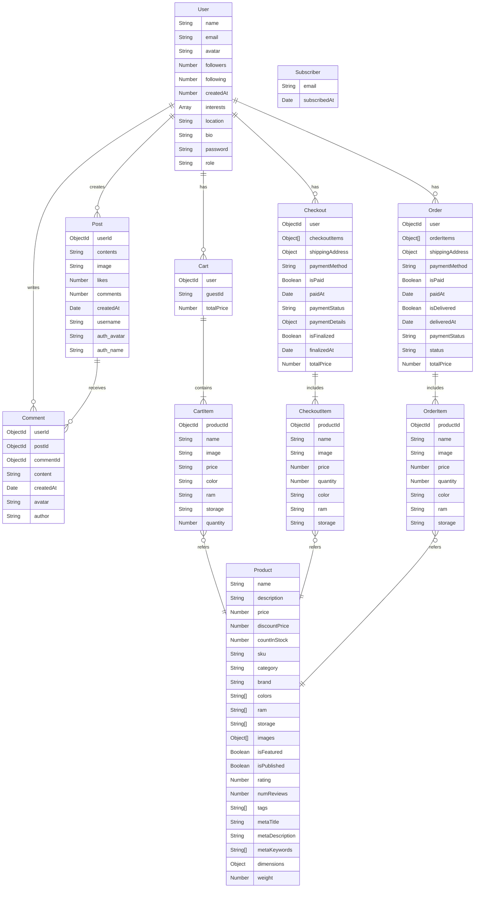

# Phonity E-Commerce API

Phonity is a comprehensive RESTful API for an e-commerce platform with Community feature built with Node.js, Express, and MongoDB. It provides a robust backend for managing products, users, shopping carts, orders, and more.

## 📋 Table of Contents

- [Phonity E-Commerce API](#phonity-e-commerce-api)
  - [📋 Table of Contents](#-table-of-contents)
  - [✨ Features](#-features)
  - [🛠️ Tech Stack](#️-tech-stack)
  - [🚀 Getting Started](#-getting-started)
    - [Prerequisites](#prerequisites)
    - [Installation](#installation)
    - [Environment Variables](#environment-variables)
  - [Schema Diagram](#schema-diagram)
  - [📊 Database Schema](#-database-schema)
  - [📚 API Documentation](#-api-documentation)
  - [🔌 API Endpoints](#-api-endpoints)
    - [Users](#users)
    - [Products](#products)
    - [Cart](#cart)
    - [Checkout](#checkout)
    - [Orders](#orders)
    - [Admin](#admin)
    - [Admin Orders](#admin-orders)
    - [Admin Products](#admin-products)
    - [Upload](#upload)
    - [Subscribers](#subscribers)
  - [🔐 Authentication](#-authentication)
  - [📁 File Uploads](#-file-uploads)
  - [🧪 Testing](#-testing)
  - [💻 Development](#-development)
    - [Code Linting](#code-linting)
    - [Development Server](#development-server)
  - [📂 Project Structure](#-project-structure)
  - [📄 License](#-license)

## ✨ Features

- **User Management**: Registration, authentication, and profile management
- **Product Management**: Create, read, update, and delete products
- **Shopping Cart**: Add, update, remove items, and merge guest carts
- **Checkout Process**: Process orders with various payment methods
- **Order Management**: Track and manage orders
- **Admin Dashboard**: Manage users, products, and orders
- **Image Upload**: Upload and manage product images via Cloudinary
- **Newsletter Subscription**: Allow users to subscribe to newsletters
- **API Documentation**: Interactive Swagger documentation
- **Security**: JWT authentication, rate limiting, and password hashing

## 🛠️ Tech Stack

- **Node.js**: JavaScript runtime
- **Express**: Web framework
- **MongoDB**: NoSQL database
- **Mongoose**: MongoDB object modeling
- **JWT**: Authentication and authorization
- **Swagger**: API documentation
- **Cloudinary**: Cloud-based image management
- **Multer**: File upload handling
- **Jest**: Testing framework
- **ESLint**: Code linting
- **Morgan**: HTTP request logger
- **Cors**: Cross-origin resource sharing

## 🚀 Getting Started

### Prerequisites

- Node.js (v20 or higher)
- MongoDB (local or Atlas)
- pnpm (v10.6.5 or higher)
- Cloudinary account (for image uploads)

### Installation

1. Clone the repository:

   ```bash
   git clone https://github.com/maruf-pfc/phonity.git
   cd phonity
   cd server
   ```

2. Install dependencies:

```shellscript
pnpm install
```

3. Set up environment variables (see [Environment Variables](#environment-variables))
4. Seed the database (optional):

```shellscript
pnpm seed
```

5. Start the server:

```shellscript
# Development mode
pnpm dev

# Production mode
pnpm start
```

### Environment Variables

Create a `.env` file in the root directory with the following variables:

```txt
# Server

PORT=5000
NODE_ENV=development

# MongoDB

MONGO_URI=mongodb://localhost:27017/phonity

# JWT

JWT_SECRET=your_jwt_secret
JWT_EXPIRES_IN=7d

# Cloudinary

CLOUDINARY_CLOUD_NAME=your_cloud_name
CLOUDINARY_API_KEY=your_api_key
CLOUDINARY_API_SECRET=your_api_secret
```

## Schema Diagram

## 📊 Database Schema



## 📚 API Documentation

phonity comes with built-in Swagger documentation. After starting the server, access the interactive API documentation at:

```txt
[http://localhost:5000/api-docs](http://localhost:5000/api-docs)
```

This provides a comprehensive interface to explore and test all available endpoints.

## 🔌 API Endpoints

### Users

- `POST /api/users/register` - Register a new user
- `POST /api/users/login` - Login a user
- `GET /api/users/profile` - Get user profile (requires authentication)

### Products

- `GET /api/products` - Get all products
- `GET /api/products/filtered` - Get filtered products
- `GET /api/products/similar/:id` - Get similar products
- `GET /api/products/best-seller` - Get best-selling products
- `GET /api/products/new-arrivals` - Get new arrivals
- `POST /api/products` - Create a new product (admin only)
- `GET /api/products/:id` - Get product by ID
- `PUT /api/products/:id` - Update product (admin only)
- `DELETE /api/products/:id` - Delete product (admin only)

### Cart

- `POST /api/cart` - Add to cart
- `PUT /api/cart` - Update product quantity
- `DELETE /api/cart` - Remove from cart
- `GET /api/cart` - Get user cart
- `POST /api/cart/merge` - Merge guest cart with user cart

### Checkout

- `POST /api/checkout` - Create checkout
- `PUT /api/checkout/:id/pay` - Update checkout to paid
- `POST /api/checkout/:id/finalize` - Finalize checkout

### Orders

- `GET /api/orders/my-orders` - Get user orders
- `GET /api/orders/:id` - Get order details

### Admin

- `GET /api/admin` - Get all users (admin only)
- `POST /api/admin` - Create a new user (admin only)
- `PUT /api/admin/:id` - Update user (admin only)
- `DELETE /api/admin/:id` - Delete user (admin only)

### Admin Orders

- `GET /api/admin/orders` - Get all orders (admin only)
- `PUT /api/admin/orders/:id` - Update order status (admin only)
- `DELETE /api/admin/orders/:id` - Delete order (admin only)

### Admin Products

- `GET /api/admin/products` - Get all products (admin view)

### Upload

- `POST /api/upload` - Upload an image

### Subscribers

- `POST /api/subscribers/subscribe` - Subscribe to newsletter

## 🔐 Authentication

The API uses JWT (JSON Web Tokens) for authentication. To access protected routes:

1. Register or login to get a token
2. Include the token in the Authorization header of your requests:

```plaintext
Authorization: Bearer <your_token>
```

## 📁 File Uploads

File uploads are handled using Multer and stored in Cloudinary. To upload files:

1. Use the `/api/upload` endpoint with a `multipart/form-data` request
2. Include the file in the `image` field
3. The API will return a URL to the uploaded file

## 🧪 Testing

Run tests using Jest:

```shellscript
# Run all tests
pnpm test

# Run tests with coverage
pnpm test -- --coverage
```

## 💻 Development

### Code Linting

```shellscript
# Lint code
pnpm lint
```

### Development Server

```shellscript
# Start development server with hot reload
pnpm dev
```

## 📂 Project Structure

```plaintext
server/
├── configs/           # Configuration files
├── controllers/       # Route controllers
├── middlewares/       # Custom middlewares
├── models/            # Mongoose models
├── routes/            # API routes
├── swagger-docs/      # Swagger documentation
├── tests/             # Test files
├── utils/             # Utility functions
├── .env               # Environment variables
├── app.js             # Express app setup
├── server.js          # Server entry point
├── seeder.js          # Database seeder
└── package.json       # Project dependencies
```

## 📄 License

This project is licensed under the ISC License.
